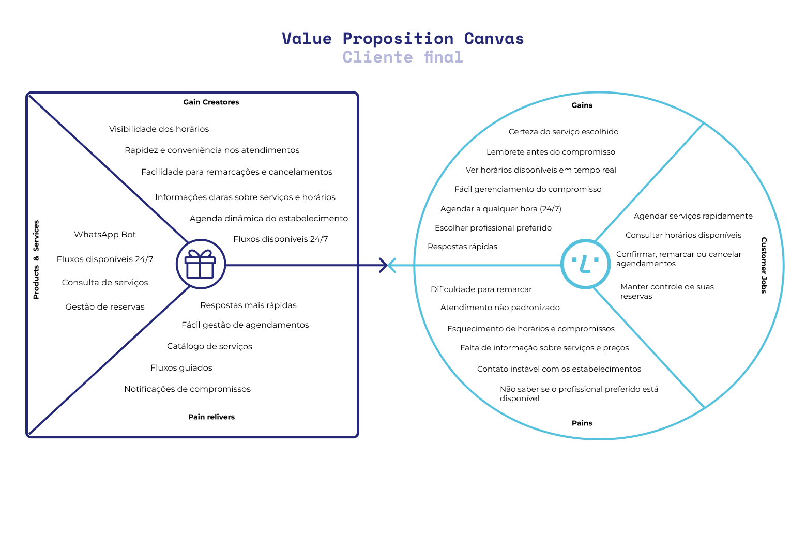
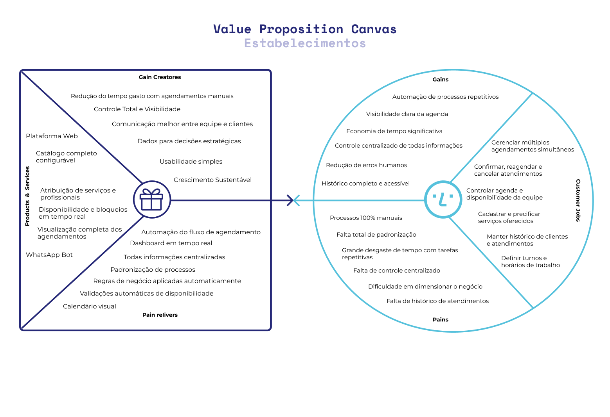

import Tabs from '@theme/Tabs';
import TabItem from '@theme/TabItem';

# Value Proposition Canvas

O Value Proposition Canvas é uma ferramenta estratégica criada por Alexander Osterwalder que permite visualizar e projetar como um produto ou serviço cria valor para seus clientes. Esse framework conecta o que os clientes realmente precisam com o que a empresa oferece.

O canvas é dividido em duas partes principais: **Bloco do Cliente** (lado direito) e **Bloco de Valor** (lado esquerdo). O lado do Cliente detalha o perfil do cliente, suas tarefas, dores e ganhos desejados. O lado de Valor descreve os produtos e serviços oferecidos, além de como eles aliviam as dores e criam ganhos para o cliente.

:::info Divisão dos Canvas

A análise foi dividida em dois canvas separados: VPC do Dono do Estabelecimento (B2B) e VPC do Cliente Final (B2C), porque cada público tem necessidades, dores e ganhos distintos que precisam ser abordados de forma específica.

Essa decisão se justifica porque operamos em um modelo B2B2C:
- O **Dono** do estabelecimento assina a solução -> foco na plataforma web
- O **Cliente Final** valida a solução no uso diário -> foco no WhatsApp Bot

O sucesso depende de satisfazer **AMBOS** os públicos simultaneamente.
:::

<Tabs
  defaultValue="vpc_dono"
  values={[
    {label: 'VPC do Dono do Estabelecimento (B2B)', value: 'vpc_dono'},
    {label: 'VPC do Cliente Final (B2C)', value: 'vpc_cliente'},
  ]}>

  <TabItem value="vpc_cliente">
    

        ## VPC do Cliente Final (B2C)
        
        Fonte: Feito pelos autores
    

    ### Perfil do Cliente

    #### Segmento de Cliente

    **Pessoas que precisam agendar serviços locais:**
    - Clientes de salões, barbearias, estúdios
    - Pacientes de clínicas e consultórios
    - Consumidores de serviços pessoais

    **Perfil comportamental**: Alta familiaridade com WhatsApp

    #### Análise do Perfil

    Nesse Value Proposition Canvas, para o cliente final, focamos em entender suas necessidades específicas relacionadas ao agendamento de serviços. 
    
    O cliente final é alguém que valoriza a conveniência e a rapidez na hora de agendar serviços. Ele está acostumado a usar o WhatsApp para se comunicar e espera uma experiência fluida e eficiente. Esse cliente pode ter dificuldades com métodos tradicionais de agendamento, como ligações telefônicas ou mensagens manuais, que são lentos e sujeitos a erros. 

    Essa análise permitiu uma melhor compreensão das possíveis dificuldades enfrentadas, incluindo a incerteza sobre a confirmação do agendamento, demora no atendimento e falta de informações claras sobre os serviços. Além disso, problemas como a dificuldade para lembrar e gerenciar compromissos, também foram mapeados com alta criticidade, já que impactam diretamente na experiência do cliente.

    Os benefícios esperados pelos usuários são voltados para uma experiência moderna, sem fricção e com autonomia para gerenciar seus compromissos. Isso inclui a capacidade de agendar a qualquer hora, receber confirmações imediatas e ter acesso a informações claras sobre os serviços oferecidos.

    ### Mapa de Valor

    O lado esquerdo do canvas representa como nossos produtos e serviços criam valor ao aliviar dores e criar ganhos para o cliente.

    Recursos como o bot de WhatsApp, fluxos intuitivos e disponíveis 24/7, e notificações automáticas são projetados para atender diretamente às necessidades identificadas no perfil do cliente. Esses serviços corroboram para oferecer um contato estável entre o prestador de serviços e o cliente, fácil acesso de informações, gestão simplificada de agendamentos e lembretes eficazes para evitar esquecimentos. Por conseguinte, esses recursos não apenas aliviam as dores, mas também criam ganhos significativos, como rapidez, autonomia, transparência e confiabilidade na experiência de agendamento.
  </TabItem>

  <TabItem value="vpc_dono">
    

        ## VPC do Dono do Estabelecimento (B2B)
        
        Fonte: Feito pelos autores
    

    ### Perfil do Cliente

    #### Segmento de Cliente

    **Prestadores de serviço e pequenos empreendimentos locais:**
    - Salões de beleza e barbearias
    - Estúdios (tatuagem, pilates, fotografia)
    - Clínicas (estética, fisioterapia, psicologia)
    - Profissionais autônomos
    - Pequenos negócios com 1-10 funcionários

    Estes empreendedores geralmente:
    - Não são técnicos (não querem sistemas complexos)
    - Focam no core business (atender clientes)
    - Têm recursos limitados (tempo e dinheiro)
    - Buscam soluções práticas e com ROI rápido

    #### Análise do Perfil

    Nesse Value Proposition Canvas, para o dono do estabelecimento, focamos em entender suas necessidades específicas relacionadas à gestão de agendamentos e operações diárias. 

    O dono do estabelecimento age como o principal tomador de decisões e gestor do negócio. É o responsável pela realização de tarefas operacionais, decidindo o fluxo do gerenciamento de agendamentos, a organização da equipe e a manutenção da qualidade do serviço oferecido aos clientes.

    Ele enfrenta desafios significativos ao tentar equilibrar essa operação diária com a necessidade de manter um serviço de qualidade para seus clientes. Muitas vezes, ele lida com processos manuais que consomem tempo e aumentam a probabilidade de erros, como agendamentos duplicados, lentos ou esquecimentos.

    Esses desafios impactam diretamente na eficiência do negócio, levando a perdas financeiras e insatisfação dos clientes. O dono do estabelecimento busca soluções que possam automatizar esses processos, proporcionando mais controle e visibilidade sobre a operação, ao mesmo tempo em que reduzem o estresse e o desgaste associados à gestão manual.

    ### Mapa de Valor

    No quesito "Products & Services", oferecemos uma plataforma web robusta e um bot de WhatsApp integrado, projetados para atender às necessidades específicas do dono do estabelecimento. 

    Os recursos da plataforma incluem funcionalidades como gestão de serviços, equipe, calendário e atendimentos, além de um dashboard operacional que oferece KPIs essenciais para o monitoramento do negócio. O bot de WhatsApp complementa essa oferta ao reduzir a carga operacional, automatizando o atendimento ao cliente e garantindo que os agendamentos sejam gerenciados de forma eficiente.

    Com o uso dessa solução, o dono do estabelecimento pode aliviar as dores críticas, tendo ganhos significativos, como economia de tempo e dinheiro, controle total e visibilidade, tranquilidade operacional e crescimento sustentável.
  </TabItem>
</Tabs>
